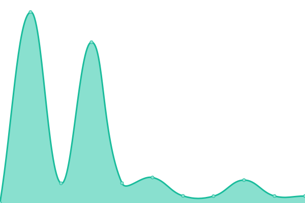
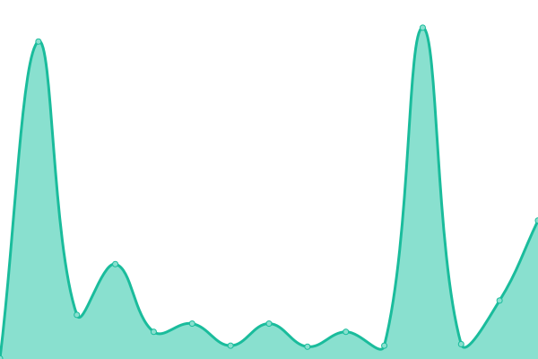

# [📈 Live Status](https://shawncsmedgas.github.io/upptime-csmedgas): <!--live status--> **🟥 Complete outage**

This repository contains the open-source uptime monitor and status page for [shawncsmedgas](https://shawncsmedgas.github.io/upptime-csmedgas), powered by [Upptime](https://github.com/upptime/upptime).

With [Upptime](https://upptime.js.org), you can get your own unlimited and free uptime monitor and status page, powered entirely by a GitHub repository. We use [Issues](https://github.com/shawncsmedgas/upptime-csmedgas/issues) as incident reports, [Actions](https://github.com/shawncsmedgas/upptime-csmedgas/actions) as uptime monitors, and [Pages](https://shawncsmedgas.github.io/upptime-csmedgas) for the status page.

<!--start: status pages-->
<!-- This summary is generated by Upptime (https://github.com/upptime/upptime) -->
<!-- Do not edit this manually, your changes will be overwritten -->
<!-- prettier-ignore -->
| URL | Status | History | Response Time | Uptime |
| --- | ------ | ------- | ------------- | ------ |
|  [Homepage](https://csmedgas.com/) | 🟥 Down | [homepage.yml](https://github.com/shawncsmedgas/upptime-csmedgas/commits/HEAD/history/homepage.yml) | 

 356ms
     
 | 

<a href="https://shawncsmedgas.github.io/upptime-csmedgas/history/homepage">96.44%</a>
    

|  [Contact Page](https://csmedgas.com/contact/) | 🟥 Down | [contact-page.yml](https://github.com/shawncsmedgas/upptime-csmedgas/commits/HEAD/history/contact-page.yml) | 

 419ms
     
 | 

<a href="https://shawncsmedgas.github.io/upptime-csmedgas/history/contact-page">88.69%</a>
    

|  [Sitemap](https://csmedgas.com/sitemap_index.xml) | 🟥 Down | [sitemap.yml](https://github.com/shawncsmedgas/upptime-csmedgas/commits/HEAD/history/sitemap.yml) | 

 238ms
     
 | 

<a href="https://shawncsmedgas.github.io/upptime-csmedgas/history/sitemap">95.12%</a>
    

<!--end: status pages-->

[**Visit our status website →**](https://shawncsmedgas.github.io/upptime-csmedgas)

## 📄 License

- Powered by: [Upptime](https://github.com/upptime/upptime)
- Code: [MIT](./LICENSE) © [Anand Chowdhary](https://anandchowdhary.com), supported by [Pabio](https://pabio.com)
- Data in the `./history` directory: [Open Database License](https://opendatacommons.org/licenses/odbl/1-0/)
